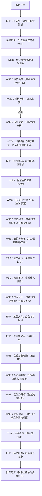

## 未分类名词
- DN:  delivery note 发货单
- ASN:  arrival shipment notice 到货通知
- BOM: bill of materials 物料清单
- MTO: Make to Order 按订单生产
- MTS: Make to Stock 按库存生产
- PO: purchase order 采购订单
- MD: material document 物料凭证

### 移动类型
#### 收货
- 101: 收货
- 103: 采购收货至冻结库存
- 501: 无订单收货

#### 发货
- 201: 
- 203: 采购发货至冻结库存
- 501: 无订单发货


## 系统
- QMS:  Quality Management System 质量管理系统
- WMS:  Warehouse Management System 仓库管理系统
- TMS:  Transport Management System 运输管理系统
- APS:  Advanced Planning and Scheduling 高级计划和排程
- MES:  Manufacturing Execution System 制造执行系统
- ERP:  Enterprise Resource Planning System 企业资源规划系统
- SCADA: Supervisory Control And Data Acquisition 监控控制与数据获取
- PLM: Product Lifecycle Management 产品生命周期管理
- CRM: Customer Relationship Management 客户关系管理系统
- SCM: Supply Chain Management 供应链管理系统


## 系统职能
### WMS
WMS 是一个关键的物流管理系统，专门设计用来支持仓库或分配中心的日常运作。通过自动化库存跟踪和高效的货物处理流程，WMS 能够显著提高仓库操作的效率和准确性。

主要功能和组件包括：
```text
库存管理：实时跟踪库存水平，管理货位，确保库存准确性。
拣选和包装：优化拣选路径和顺序，减少拣选错误，提高订单处理速度。
接收和发运：自动化接收过程，快速处理入库和出库，减少等待时间。
作业和任务管理：分配和优化仓库作业任务，提高员工生产力。
报告和分析：提供详细的库存和性能报告，支持决策制定。
```


### SCADA
SCADA 系统是一种工业自动化控制系统，用于监控和控制分布在广泛地理位置的设施和基础设施。它通过收集实时数据，使操作员能够远程监控整个过程，优化操作和提高效率。

主要功能包括：
```text
实时数据采集：从现场传感器和设备收集数据。
远程监控：允许操作员远程查看和控制工厂设备和过程。
报警和事件管理：自动检测异常情况并提醒操作员。
历史数据记录：存储过程数据，用于趋势分析和未来优化。
```

